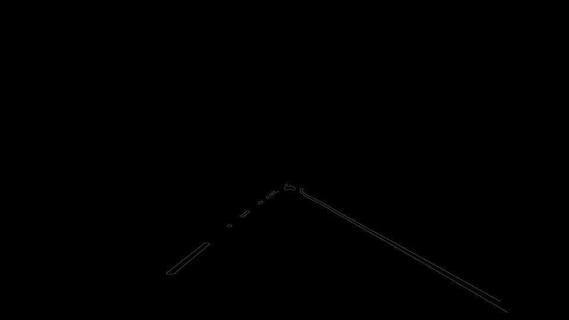
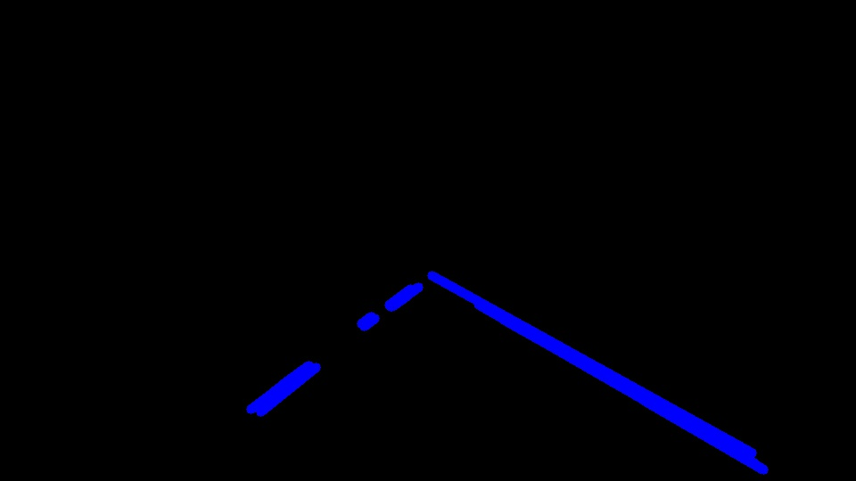
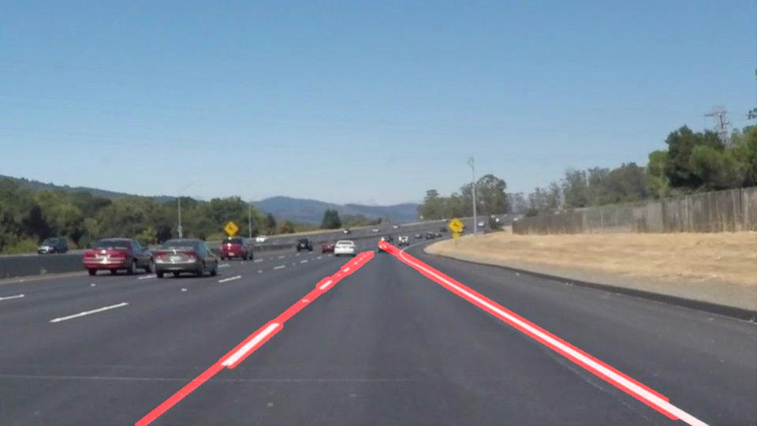

# **Finding Lane Lines on the Road** 

## Writeup Template

### You can use this file as a template for your writeup if you want to submit it as a markdown file. But feel free to use some other method and submit a pdf if you prefer.

---

**Finding Lane Lines on the Road**

The goals / steps of this project are the following:
* Make a pipeline that finds lane lines on the road
* Reflect on your work in a written report

[//]: # (Image References)

[image1]: ./IntermediateImages/GraysolidWhiteCurve.jpg "Grayscale"
[image2]: ./IntermediateImages/CannysolidWhiteCurve.jpg "Canny Edge Detected Output"
[image3]: ./IntermediateImages/ROIsolidWhiteCurve.jpg "ROI filtered output"
[image4]: ./test_images_output/solidWhiteCurve.jpg "Lane Mapped Output"

---

### Reflection

### 1. Describe your pipeline. As part of the description, explain how you modified the draw_lines() function.

 The core of the pipeline used in this project is executed as part of the process image function. This takes in a raw image and outputs an image with the lane lines drawn in. The main steps of the pipeline are - 
 
 1. Read in the image : I used the imread function bundled in with the mathplotlib library to read in the image. 
 
 2. Convert the image to grayscale : I used the openCV cvtColor function to convert the image to gray scale. This allows us to use the gradient between two points to identify the edges in the image. 

 
 3. Applying a Gaussian averaging filter: Before applying the edge detection algorithm, I apply a simple Gaussian filter with a small kernel size (5 pixels in this project) to remove the high frequency components in the image. This helps to refine the overall accuracy of the Canny edge detection mechanism. Note that the Canny edge detection mechanism also internally applies a Gaussian filter of the same kernel size.
 
 4. Applying the Canny edge detection mechanism: I use the openCV Canny function to identify the edges in the image. Since the threshold is an 8-bit number, I use a lower threshold limit of 50 and a high threshold limit of 150. The recommended ratio between the low and high threshold is in the order of 1:2 to 1:3, and using the high end of that limit allows the selection of only very steep gradients in the image. Given the two iterations of low pass Gaussian filtering to blur the image, this helps to generate more sharp edges in the image.
 
 

 5. Applying an ROI filter: Once the edges have been detected in the image, I apply a ROI (region of interest) filter to mask out the edges that are outside the relative viewing area. For the purpose of this exercise, I am using a four point polygon to select the area of interest in the image. This allows rejection of edges that are on the edge of the image, while still being able to handle additional sections of the curved lanes that span more than a typical triangular viewing angle. 
  

6. Applying a Hough transform: Once the relevant edges have been detected, I apply a Hough transform to identify lines in the image. Since we are trying to identify lane lines, the limiting factor for line length would be the inter-lane dashed lines, and the maximum gap between lines is determined by the distance between two lanes. For the purpose of the test images, I have used a minimum line length of 7 pixels and a maximum line gap of 10 pixels. The threshold for minimum number of votes to determine the presense of a line is 80. The distance resolution is in the order of 3 pixels. 

 
7. Connecting lines to identify the lane: Once the lane lines are selected, I use a simple slope computation method to separate out the lines identifying the left lane and those identifying the right lane. I compute the slope of each line and depending on the direction of the slope, I sort it out into left lane lines vs right lane lines. Once this is completed, I compute the average slope of each line and take lowest intercept and a point slightly below the highest intercept to draw the final line.

To apply this pipeline on a video rather than a single image, I broke the process out into the following steps - 

1. Breaking the video apart into individual frames: I used the open CV VideoCapture function to capture the video and then the read funtion to read each frame in the video and separate it out into individual files. N

2. Applying the pipeline on every frame: Once each frame was broken out, I applied the pipeline created above on each individual frame to generate a second set of frames with the lane highlighted.

3. Recreating the video: After each frame had been updated, I stitched them together using the open CV VideoWriter codec to create a new video that overlaid the detected lane on top of the source video. 

<iframe width="420" height="315" src="test_videos/challengeoutput.mp4" frameborder="0" allowfullscreen></iframe>

### 2. Identify potential shortcomings and possible improvements with your current pipeline

There are a couple of shortcomings that still need to be resolved with the current pipeline.

1. Automatic line rejection based on slopes: Currently the slope rejection value is hardcoded based on the video, and is determined based on trial and error. This can be changed to a smarter algorithm that looks through the slopes of all the lines and dynamically rejects outlier slopes based on a mean +/- 3 sigma rubric, so that only the relevant slopes are being included in the average slope computation. 

2. Video Flicker: Currently the stitched video does not include any frame rate information from the original video. This can be improved by analysing the original video and frame rate breakdown to determine what the frame rate on the raw image is, and to use an equivalent frame rate when stitching the images back together.

3. The current algorithm seems to track one of the two lines (either right or left) better than the other becuase we are using the same slope rejection algorithm on both sides. This can be optimized depending on the viewing angle of the observer and the relative tilt of one line vs the other.